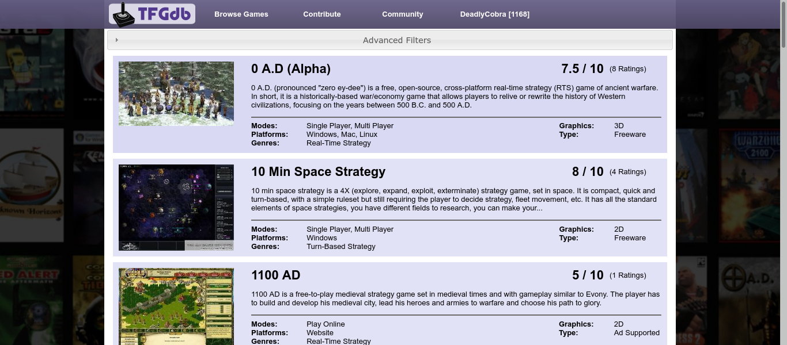

# tfgdb.com

TFGdb.com is designed to be a open database of free games for pc where any user can add content. The main aim was to provide quality information and direct download links for all the games in the database. It features an extensive backend for administrators to monitor and moderate content and users. It also features a very clean and user friendly interface including extensive search functionality allowing users to quickly find a game they like.

The website was programmed in PHP, CSS and HTMl and was integrated into the login and forum functionality of PHPBB. Apart from the login backend and forum, the website was built from scratch.

The site was designed in 2012 and iteratively built upon over the next couple of years. Due to lack of time it is now an abandoned project.

## Features

Large (>800 at time of writing) collection of games indexed. Advanced search functionality is provided by using the metadata attached to all the games.

Each game has several bits of artwork attached and a load of metadata to allow for very fine grain searching. Games can also be reviewed and rated by users and direct download links are provided for each game.

Every user of the site can login and append to games or add new games. The data that can be entered is very detailed.

The authentication and authorisation is provided by phpBB. A points based system is integrated into the system to encourage users to contribute with prizes which can be redeemed when a user has enough points.

An admin interface allows moderators to check on the status of the system, latest contributions and approve the contributions of newer users.

